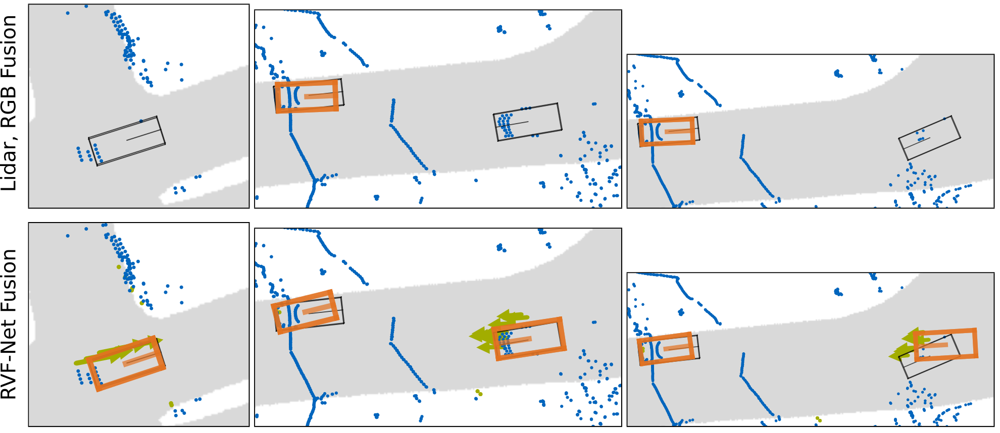

# RadarVoxelFusionNet
This project provides a 3D object detection network. The project focuses on the sensor fusion of radar, lidar and camera data with deep neural network. The network architecture is inspired by [VoxelNet](https://arxiv.org/abs/1711.06396) and augmented to process several input data. The network comes with an interface to be trained and tested on the nuScenes data set. Two example videos show the detection performance with a camera/lidar fusion on the left and the radar, camera, lidar fusion of the RVF-Net on the right. 




## Installation


- Install docker on your machine.
- Download the nuscenes data set according to their [guidelines](https://github.com/nutonomy/nuscenes-devkit#nuScenes).
- Clone this repository with submodules (`git clone --recursive git@github.com:TUMFTM/RadarVoxelFusionNet.git`) into `<local_path-to-repository>`.
- For an out-of-the-box inference, download: the trained checkpoint, model config and split configurations [here](https://syncandshare.lrz.de/getlink/fiHq9RPabSC7YF4Q9oGBVLKS/) and store them as your <local_data_folder>.
- Build the docker image:

```
cd <local_path-to-repository>
docker build -t radarpointnet:1.0.0 .
```

- Create and run a container:

```
docker run --shm-size 8G \
    --gpus device=<device-id> \
    -v <local-path-to-nuscenes-dataset>:/nuscenes \
    -v <local_data_folder>:/persistent_storage \
    --name radarpointnet -tdi radarpointnet:1.0.0
```

- Enter the container:

```
docker attach radarpointnet
```

- Build SparseConvNet:
```
cd thirdparty/SparseConvNet
bash ./develop.sh
```

This build needs to be done once the container is running and cannot 
be done while building the container using the Dockerfile. This is a limitation
as SparseConvNet needs CUDA present during build. Alternatively you could set your default docker runtime to nvidia and 
uncomment the corresponding lines in the Dockerfile.

Optional docker build configurations:

* `-v <path-to-serialized-dataset>:/nuscenes_fusion` To mount a directory containing serialized datasets
* `-p <some-port-number>:6006` for use with Tensorboard


### Configs

Configurations are defined and specified in python files in `rvfn/config/`. These 
configurations can be easily serialized to and de-serialized from JSON using `rvfn/tools/make_configs`.
For convenience, several serialized versions of these are already present in 
`configs/`. For further details see the README in `configs/`.

### Preparing the Dataset

#### Creating a Training/Validation Split
The official nuScenes split, and some variations of it are available in `splits/`.
To make your own split, you can use `rvfn/tools/make_splits.py`.

#### Serializing a Dataset (Optional)
This repository allows for training either on a serialized, or an on-the-fly created dataset.
Depending on the pre-processing operation you choose, serializing the dataset may increase training
speed. However it can consume a lot of disk space (~200 GB for a lidar-only version of nuScenes),
and it precludes the use of on-the-fly augmentations. 

You can use `rvfn/tools/serialize_dataset.py` to pre-process and serialize the dataset.

### Training

For on-the-fly training of the RVF-Net, use the following configured command inside the docker container:
```
python /workspace/rvfn/train.py \
/persistent_storage/configs/pipeline/lidar-rgb-radar.json \
/persistent_storage/configs/train.json \
/persistent_storage/configs/eval.json \
--train_samples /persistent_storage/splits/official_min_1/train_samples.json \
--val_samples /persistent_storage/splits/official_min_1/val_samples.json
```

Alternatively, for a serialized dataset:

```
python /workspace/rvfn/train.py <pipeline-config> <train-config> <eval-config> \
--train_samples <train-split> \
--val_samples <val-split> \
--serialized <dataset-directory>
```

### Evaluation

The training can be monitored via tensorboard. The following command performs evaluation and metric calculation with the provided pre-trained checkpoint: 

```
python /workspace/rvfn/eval.py \
/persistent_storage/configs/pipeline/lidar-rgb-radar.json \
/persistent_storage/configs/eval.json \
/persistent_storage/RVFN_checkpoint \
--val_samples /persistent_storage/splits/official_min_1/val_samples.json
```

Alternatively, for serialized dataset:

```
python /workspace/rvfn/eval.py <pipeline-config> <eval-config> <checkpoint-file> \
--val_samples <val-split>
--serialized <dataset-directory>
```

See `rvfn/eval.py` usage for more options and functionalities.

### Inference

To run inference of a the pre-trained nework execute:
```
python /workspace/rvfn/infer.py \
/persistent_storage/configs/pipeline/lidar-rgb-radar.json \
/persistent_storage/RVFN_checkpoint \
/persistent_storage/inference_output \
--samples /persistent_storage/splits/official_min_1/val_samples.json \
--min_conf 0.999 \
--write_preds
```
See `rvfn/infer.py` usage for more options and functionalities.

Example inference output, after conversion to an animation:


### Contributions

This implementation is created during the Interdisciplinary Project (IDP) of Ehsan Shafiei at the [Institute of Automotive Technology](https://www.mw.tum.de/en/ftm/home/) of the Technical University of Munich.

If you find our work useful in your research, please consider citing:

    @Article{nobis21fusion,
        author={Felix Nobis, Ehsan Shafiei, Phillip Karle, Johannes Betz and Markus Lienkamp},
        title={Radar Voxel Fusion for 3D Object Detection},
        journal={Applied Sciences},
        volume={11},
        year={2021},
        number={12},
        article-number={5598},
        doi={https://doi.org/10.3390/app11125598}
    }
